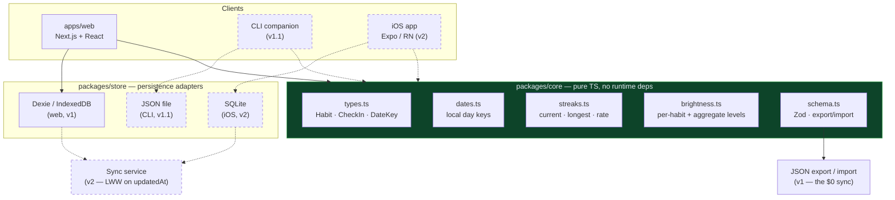

# streak-map — Project Spec (MVP v1)

> A local-first, open-source habit tracker that visualizes consistency as a
> GitHub-style contribution grid. Dev-first, approachable to everyone else.

- **Status:** spec approved, pre-implementation
- **Date:** 2026-08-18
- **Repo:** `streak-map` (new, public, OSS)
- **Audience:** developers first; deliberately legible to non-developers

---

## 1. Product summary

### The problem
Focus and consistency are hard to sustain without visible feedback. Existing
habit trackers with contribution-graph visuals are paywalled or feature-limited.

### The wedge
Developers already have a deeply internalized relationship with the GitHub
contribution graph — green squares are a *known emotional trigger*. streak-map
borrows that exact visual grammar for habits. No onboarding required for the
target user: they understand the interface on sight.

### Non-negotiable v1 principles
1. **Local-first.** No account, no signup, no server. Open the page, start tracking.
2. **Your data is yours.** One-click JSON export, importable. No lock-in.
3. **Keyboard-first.** Devs live on the keyboard; this is a differentiator competitors ignore.
4. **Sync-ready, not synced.** v1 ships zero sync, but the data model makes adding it later a feature, not a rewrite.

---

## 2. Scope

### In scope for v1

| # | Feature | Notes |
|---|---------|-------|
| F1 | Create / edit / archive / delete habits | name, description, color, interval, target, start date |
| F2 | Per-habit contribution grid | 365-day trailing tile calendar, GitHub grammar |
| F3 | **Aggregate "all habits" grid** | single calendar, brightness = that day's total check-ins relative to the densest day across the whole grid (see §4) |
| F4 | Check-in / increment / decrement | supports targets > 1 per interval |
| F5 | Streak stats | current streak, longest streak, total active days, completion rate |
| F6 | Custom interval + target | `daily` \| `weekly`, target N completions per interval |
| F7 | Per-habit accent color | required — the aggregate view needs habits visually distinguishable |
| F8 | JSON export / import | full round-trip, schema-versioned |
| F9 | Keyboard navigation | `j`/`k` habit nav, `space` or `c` to check in today, `?` shortcut help |

### Explicitly out of scope for v1 (backlog)
- **Reminders / notifications** — needs a scheduling mechanism (service worker + Notification API, or push infra). Deliberately deferred; it's the single largest complexity jump in the feature list.
- **Accounts / cloud sync** — the data model prepares for it (§3.4); the feature is v2.
- **CLI companion** (`streak-map done deep-work`) — highest-leverage dev-viral feature. Target v1.1, which is why `packages/core` exists from day one.
- **GitHub graph import** ("track your real commits as a habit") — great first-run wow moment. v1.1.
- **Themes beyond per-habit color** — cosmetic, cheap to add later.
- **Mobile/iOS app** — v2, Expo + React Native, reusing `packages/core`.

### Success criteria for v1
- A new visitor can create a habit and check in within 15 seconds, with no account.
- The aggregate grid renders 365 days across N habits without perceptible lag.
- Full data export → wipe browser → import → identical state.
- An outside contributor can clone, `pnpm install`, `pnpm dev`, and be running in under 2 minutes.

---

## 3. Data model

### 3.1 Core entities

```ts
// packages/core/src/types.ts

/** A calendar day key in LOCAL time: "YYYY-MM-DD". Never a timestamp. */
export type DateKey = string;

export type Interval = 'daily' | 'weekly';

export interface Habit {
  id: string;              // uuid v7 — sortable, collision-free, sync-friendly
  name: string;
  description?: string;
  color: string;           // hex accent, e.g. "#2ea043"
  interval: Interval;
  target: number;          // completions required per interval; default 1
  startDate: DateKey;
  order: number;           // manual sort position in the UI
  archivedAt?: string;     // ISO timestamp; archived habits hide but keep history
  createdAt: string;       // ISO
  updatedAt: string;       // ISO — required for future last-write-wins sync
  deletedAt?: string;      // ISO — soft delete, required for sync tombstones
}

/**
 * ONE row per (habitId, date). `count` holds the number of completions that
 * day rather than storing one row per completion event.
 *
 * Why: querying a 365-day grid becomes a single indexed range scan instead of
 * an aggregation over thousands of event rows, and sync conflict resolution
 * collapses to last-write-wins on a single day-cell.
 */
export interface CheckIn {
  id: string;              // uuid v7
  habitId: string;
  date: DateKey;           // LOCAL calendar day
  count: number;           // >= 1; removing the last completion deletes the row
  createdAt: string;
  updatedAt: string;
  deletedAt?: string;
}
```

### 3.2 The timezone decision (read this before writing any date code)

`date` is stored as a **local** `YYYY-MM-DD` string, never as a UTC timestamp.

"Did I do it today?" is a question about the user's wall calendar, not about an
instant on a timeline. If you store timestamps and derive the day key with UTC
math, a user in UTC+7 checking in at 06:00 local gets recorded on the *previous*
day, silently breaking their streak. This is the most common bug class in habit
trackers, and it is unrecoverable after the fact because the original local
context is gone.

**Rule:** the day key is computed once, at check-in time, from the device's local
clock, and then treated as an opaque string everywhere downstream. All grid,
streak, and brightness math operates on `DateKey` strings and never on `Date`
objects.

### 3.3 Indexes (Dexie)

```ts
db.version(1).stores({
  habits:   'id, order, archivedAt, deletedAt',
  checkins: 'id, habitId, date, [habitId+date], deletedAt',
  meta:     'key',
});
```

`[habitId+date]` is the compound index the whole app leans on: it makes both
"one habit's year" and "did this habit happen on this day" O(log n) lookups, and
it enforces the one-row-per-day-per-habit invariant.

### 3.4 What makes this sync-ready

Nothing in v1 talks to a network, but three properties are baked in now because
retrofitting them is expensive:

1. **Client-generated uuid v7 ids** — two devices can create records offline without collision, and ids sort by creation time.
2. **`updatedAt` on every record** — enables last-write-wins merge without a server-assigned version.
3. **`deletedAt` soft deletes** — a hard delete is invisible to a peer; a tombstone propagates. Without this, deleted habits resurrect on first sync.

The v2 sync layer is then an additive `syncedAt` cursor plus a push/pull endpoint,
not a data migration.

---

## 4. The brightness algorithm (core visual spec)

This is the distinguishing feature. Get it exactly right.

### 4.1 Per-habit grid

For habit `H` on day `D`:

```
count   = checkins[H][D].count  (0 if absent)
target  = H.target
level   = 0                                     if count == 0
        = clamp(ceil(count / target * 4), 1, 4) otherwise
```

Level 0 renders as the empty/idle tile; levels 1–4 are increasing opacity of the
habit's accent color. Hitting target exactly = level 4 (full). Overshooting a
target does not produce a brighter-than-full tile — the ceiling is the point.

### 4.2 Aggregate "all habits" grid

This is the view you specified: one calendar covering every habit, where a day's
brightness reflects how dense that day was *relative to your densest day*.

```
total(D)  = Σ over all non-archived habits of checkins[h][D].count
peak      = max( max over all D in rendered window of total(D), SCALE_FLOOR )
intensity = total(D) / peak                      // 0..1
level(D)  = 0                                    if total(D) == 0
          = clamp(ceil(intensity * 4), 1, 4)     otherwise
```

**Worked example (your stated requirement):** your densest day has 5 check-ins,
so `peak = 5`. The next day you complete 1. `intensity = 1/5 = 0.2`,
`level = ceil(0.2 * 4) = 1` — the dimmest lit shade. A 5-check-in day is level 4.
Correct.

**`SCALE_FLOOR = 4`** — why it exists: on day one, `peak` would be 1, making a
single check-in render at maximum brightness. Every early day looks perfect, the
graph has no dynamic range, and the visualization is meaningless until you happen
to have a busy day. Flooring the denominator at 4 means the grid *earns* its
brightness — early days read dim and fill in as the habit stack grows. Make this
a named constant, not a magic number; it is a tuning knob.

**Window:** `peak` is recomputed over the currently rendered window (default:
trailing 365 days), not all-time. A monster day from two years ago should not
permanently flatten this year's grid.

**Recompute trigger:** `peak` is derived, never stored. Recompute on any check-in
mutation or window change. At 365 days across N habits this is trivially fast; do
not prematurely cache it.

### 4.3 Streak math

```
An interval is SATISFIED when its total count >= target.
currentStreak   = consecutive satisfied intervals counting backward from today
longestStreak   = the longest consecutive satisfied run in all history
totalActiveDays = count of days with at least one check-in
completionRate  = satisfied intervals / elapsed intervals since startDate
```

**The grace rule (important for how the product feels):** when computing
`currentStreak`, an unsatisfied *today* does not break the streak — the walk
starts at yesterday and today is treated as still-in-progress. Without this,
every user opens the app each morning to a streak of 0, which reads as punishment
for the crime of it being early. The streak only breaks once a full interval has
elapsed unsatisfied.

---

## 5. Tech stack

Chosen for: mainstream 2026 defaults (large contributor pool), zero hosting cost,
and a clean path to iOS.

| Layer | Choice | Why this one |
|-------|--------|--------------|
| Framework | **Next.js (App Router) + React** | The default React meta-framework — largest contributor pool. Chosen over plain Vite because when v2 sync lands, the API routes live in the same app: no framework migration at the worst possible moment. |
| Language | **TypeScript**, `strict: true` | Non-negotiable for a multi-contributor OSS repo. |
| Styling | **Tailwind CSS** | Highest-familiarity styling layer; contributors can ship UI without learning a bespoke system. |
| Local DB | **Dexie** (IndexedDB) + `dexie-react-hooks` | `useLiveQuery` makes the UI reactive to the DB directly — no Redux/Zustand needed. IndexedDB (not localStorage) because years of check-ins exceed localStorage's ~5MB ceiling and it has no indexes. |
| Server state | **none in v1** | There is no server. Deliberate. |
| Validation | **Zod** | Guards the import path — untrusted JSON must never corrupt the local DB. |
| Dates | **date-fns** | Tree-shakeable, immutable. All calls operate on `DateKey` strings at the boundary. |
| Testing | **Vitest** + React Testing Library + `fake-indexeddb` | Streak and brightness math get real unit tests; `fake-indexeddb` makes store tests run headless in CI. |
| Lint/format | **Biome** | One fast binary replacing ESLint + Prettier. Fewer config files is a real contributor-onboarding win. |
| Monorepo | **pnpm workspaces + Turborepo** | Standard, cacheable, cheap. |
| Hosting | **Vercel free tier** | v1 is effectively static — $0 forever at this scale. |
| iOS (v2) | **Expo / React Native** | Reuses `packages/core` verbatim; only the storage adapter is rewritten. |

> Pin exact versions at scaffold time — take the current stable major of each and
> record them in the README so contributors match your environment.

### 5.1 Repo layout

```
streak-map/
├── apps/
│   └── web/                     # Next.js app — UI only
│       ├── app/
│       ├── components/
│       │   ├── grid/            # ContributionGrid, Tile, Legend, MonthLabels
│       │   ├── habit/           # HabitList, HabitForm, HabitCard
│       │   └── stats/           # StreakStats
│       └── lib/
├── packages/
│   ├── core/                    # PURE domain logic — zero React, zero Dexie
│   │   └── src/
│   │       ├── types.ts         # Habit, CheckIn, DateKey
│   │       ├── dates.ts         # DateKey construction + calendar walking
│   │       ├── streaks.ts       # current/longest/active/rate
│   │       ├── brightness.ts    # §4 algorithms
│   │       └── schema.ts        # Zod schemas, export/import versioning
│   └── store/                   # Dexie schema + repository functions
│       └── src/
├── docs/
│   └── SPEC.md                  # this file
├── .github/
│   ├── workflows/ci.yml
│   ├── ISSUE_TEMPLATE/
│   └── pull_request_template.md
├── pnpm-workspace.yaml
├── turbo.json
├── biome.json
├── LICENSE
├── README.md
├── CONTRIBUTING.md
└── CODE_OF_CONDUCT.md
```

**Why `core` is dependency-free:** it is the one package that must be importable
by three very different runtimes — the web app (browser), the future CLI (Node,
reading a JSON file), and the future iOS app (React Native, backed by SQLite).
The moment `core` imports React or Dexie, that portability is gone and each
platform reimplements streak math — which is exactly how two clients start
disagreeing about your streak. This constraint is worth enforcing in CI.

### 5.2 Architecture



Solid lines are v1. Dashed are planned — drawn here so the v1 boundaries are
chosen with them in mind.

---

## 6. Git & OSS setup

### 6.1 Repository
- **Name:** `streak-map`
- **Visibility:** public from the first commit — the git history is part of the pitch for a habit tracker that looks like git.
- **Description:** `A local-first habit tracker that turns your consistency into a GitHub-style contribution grid. No account, no cloud, your data stays yours.`
- **Topics:** `habit-tracker` `local-first` `nextjs` `typescript` `indexeddb` `contribution-graph` `productivity` `open-source` `pwa`

### 6.2 License: MIT

MIT maximizes adoption and contribution, which is your stated goal ("others able
to join develop and use it"). Contributors — especially at companies — face the
least friction with MIT, and permissive licensing is the norm for JS tooling.

The tradeoff to accept knowingly: MIT permits someone to wrap streak-map in a
paid closed-source SaaS. If preventing that matters more to you than contributor
volume, AGPL-3.0 is the alternative. **Pick before the first external PR** —
relicensing later requires consent from every contributor, which in practice
means you cannot.

### 6.3 Branching & commits
- `main` is always deployable. Protect it: require a PR, require CI green, no direct pushes.
- Feature branches: `feat/aggregate-grid`, `fix/streak-timezone`, `docs/contributing`.
- **Conventional Commits** — `feat:` `fix:` `docs:` `chore:` `test:` `refactor:`. Thematically perfect for this project, and it makes automated changelogs free later.

### 6.4 CI (`.github/workflows/ci.yml`)
Runs on every PR, all blocking:
1. `pnpm install --frozen-lockfile`
2. `pnpm biome ci .` — lint + format
3. `pnpm typecheck` — `tsc --noEmit` across the workspace
4. `pnpm test` — Vitest, all packages
5. `pnpm build` — Turborepo build of `apps/web`
6. **`core` purity check** — assert `packages/core/package.json` has no runtime `dependencies`. Cheap script, prevents the one architectural mistake that would quietly cost you the iOS port.

### 6.5 Contributor-facing files

| File | Must contain |
|------|--------------|
| `README.md` | Screenshot/GIF of the grid above the fold, one-paragraph pitch, live demo link, `pnpm install && pnpm dev` quickstart, feature list, roadmap, license |
| `CONTRIBUTING.md` | Dev setup, repo tour, commit convention, test expectations, PR checklist |
| `CODE_OF_CONDUCT.md` | Contributor Covenant 2.1, verbatim |
| `.github/ISSUE_TEMPLATE/` | `bug_report.yml`, `feature_request.yml` |
| `.github/pull_request_template.md` | What/why, screenshots for UI changes, tests added |
| `docs/SPEC.md` | this document |

Seed 5–8 issues labeled `good first issue` before announcing the repo. An OSS
project with zero open issues reads as finished and attracts no contributors;
the label is the single highest-conversion recruiting tool you have.

### 6.6 Initial commit sequence

```bash
# 1. scaffold
mkdir streak-map && cd streak-map
git init -b main

# 2. tooling: pnpm-workspace.yaml, turbo.json, biome.json, tsconfig base,
#    .gitignore, .node-version, LICENSE
git add -A && git commit -m "chore: initialize monorepo tooling"

# 3. domain first — core is testable with zero UI
git commit -m "feat(core): habit and check-in types with local date keys"
git commit -m "feat(core): streak, brightness, and aggregate-scale math"
git commit -m "test(core): cover streak grace rule and aggregate normalization"

# 4. persistence
git commit -m "feat(store): dexie schema with habitId+date compound index"

# 5. UI
git commit -m "feat(web): contribution grid and habit management"

# 6. OSS surface
git commit -m "docs: readme, contributing, code of conduct, spec"

git remote add origin git@github.com:<you>/streak-map.git
git push -u origin main
```

Build `core` before any UI. Streak and brightness math is where the real bugs
live, it is fully testable headless, and having it locked down means the UI work
is purely visual — which is also what makes the design step below safe to run in
parallel.

---

## 7. Claude Design prompt (paste this)

```
Design the UI for "streak-map" — an open-source, local-first habit tracker that
visualizes habit consistency as a GitHub-style contribution grid.

AUDIENCE: developers first, but legible to non-developers. The GitHub
contribution graph is the visual anchor users already understand — lean into
that familiarity rather than inventing new visual language.

TONE: dark-mode-first, calm, dense, precise. Think GitHub / Linear / Vercel —
not playful, not gamified, no cartoon mascots, no confetti. The satisfaction
comes from the grid filling in, nothing else.

SCREENS TO DESIGN:

1. DASHBOARD (primary screen)
   - Header: "streak-map" wordmark, total-check-ins-this-year count, settings icon
   - AGGREGATE GRID (hero element, top of page): one full-width contribution
     calendar covering the trailing 365 days across ALL habits combined.
     53 columns x 7 rows of rounded squares, month labels along the top,
     Mon/Wed/Fri labels down the left, a "Less -> More" intensity legend at
     bottom right. A day's brightness = that day's total check-ins across all
     habits, normalized against the densest day in the window (5 levels:
     empty + 4 increasing intensities).
   - Stat row beneath the grid: current streak, longest streak, total active
     days, completion rate
   - HABIT LIST below: one card per habit, each showing the habit name, its own
     accent color, its current streak, a compact grid (trailing ~90 days), and a
     large tap/click target to check in for today. Checked-in habits are
     visually settled, not loud.
   - Empty state for a brand-new user with zero habits

2. HABIT DETAIL
   - Full 365-day grid for that single habit in its accent color
   - Streak stats, target and interval, start date
   - Edit and archive actions

3. HABIT EDITOR (modal or sheet)
   - Name, optional description, start date
   - Interval selector (Daily / Weekly)
   - Target stepper ("1 / day", with - and + controls)
   - Accent color picker: a single row of ~10 color swatches
   - Save and Cancel; Delete is present but visually de-emphasized

4. SETTINGS
   - Export data (JSON), Import data (JSON)
   - Theme toggle, keyboard-shortcut reference, link to the GitHub repo

REQUIREMENTS:
- Dark mode is the default and must be the strongest design. Light mode second.
- Design the grid tile at all 5 intensity levels, including hover and today's
  outlined state.
- Show a tooltip design for a hovered tile: "3 check-ins on Aug 12, 2026".
- Keyboard-first: show a visible focus ring style, and include a shortcuts
  overlay (triggered by "?") listing j/k to move between habits, space or c to
  check in, n for new habit.
- Responsive: on mobile the 365-day grid scrolls horizontally rather than
  shrinking tiles below a legible size; the habit list stacks.
- Accessibility: intensity must not rely on color alone — tooltips and
  aria-labels carry the count. Verify contrast in both themes.
- Plain CSS-variable-friendly tokens; this will be built in Tailwind.

DELIVER: dashboard (populated + empty), habit detail, habit editor, settings,
and a component sheet showing tile states, buttons, inputs, and the color
swatch row.
```

---

## 8. Build order

| Step | Work | Gate |
|------|------|------|
| 0 | Repo scaffold, tooling, CI, license, OSS docs | CI green on an empty build |
| 1 | `core`: types, date keys, streak math, brightness math | Unit tests pass, including the grace rule and `SCALE_FLOOR` behavior |
| 2 | `store`: Dexie schema, repository fns | Store tests pass against `fake-indexeddb` |
| 3 | UI: grid component (aggregate + per-habit) | Renders 365 days from seeded fixture data |
| 4 | UI: habit CRUD, check-in interaction, stats | Full loop usable end to end |
| 5 | Export / import + Zod validation | Export → wipe → import round-trips identically |
| 6 | Keyboard shortcuts + a11y pass | Fully operable with no mouse |
| 7 | README with GIF, seed `good first issue`s, deploy, announce | Public |

**v1.1:** CLI companion, GitHub-graph import, reminders.
**v2:** accounts + sync, iOS app.

---

## 9. Decisions log

| Decision | Choice | Rationale |
|----------|--------|-----------|
| Name | `streak-map` | Describes the artifact; no trademark risk; survives the iOS port |
| Data locality | Local-first, no accounts | Zero hosting cost, instant first-run, strongest privacy story |
| Repo structure | Monorepo from day one | Sync + iOS + CLI are all confirmed roadmap; extracting a shared `core` later collides with the iOS port. **Reversible cheaply on day one, expensively after.** |
| Framework | Next.js over plain Vite | v2 sync needs a server; migrating frameworks mid-roadmap is the costlier path |
| Storage | IndexedDB via Dexie | localStorage has no indexes and a ~5MB ceiling; years of check-ins exceed both |
| Day key | Local `YYYY-MM-DD` string | UTC-derived day keys silently corrupt streaks across timezones, unrecoverably |
| Check-in shape | One row per (habit, day) with a count | Fast range scans; sync conflicts collapse to LWW on one cell |
| Aggregate scale | Windowed peak, floored at 4 | Prevents a single early check-in from rendering at full brightness and flattening the graph's meaning |
| Streak grace | Today never breaks the streak | Otherwise every morning opens on a zeroed streak, which reads as punishment |
| License | MIT | Maximizes contributors; **must be settled before the first external PR** |
| Reminders | Deferred to v1.1 | Largest complexity jump in the feature set; not required for the core loop |
